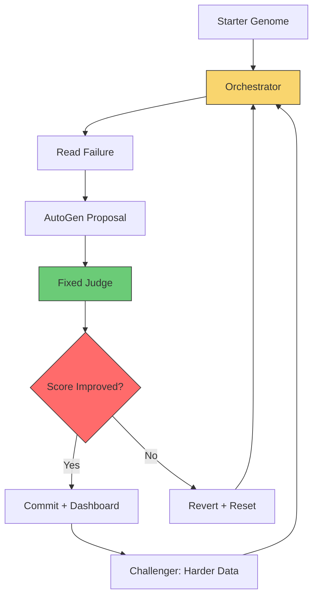

# Building a Self-Evolving Data Engineer — 7 Lessons from the CleanLoop

I've spent two decades building data systems. The one thing that never changes: someone always has to read the failure, pick the next fix, and carry the loop memory forward.

What if the loop could carry its own memory?

That's the question behind the CleanLoop project. Not a grand multi-agent swarm. Not a general-purpose AI that rewrites your entire codebase. A bounded mutation loop over one file, one fixed judge, and one visible artifact trail.

This article walks all seven lessons of the Self-Evolving Data Engineer course — the architecture, the trade-offs, and the safety controls that keep the loop from running away.

:::tip{title="How to read this series"}
Start with this overview if you want the full architecture map first. Start with CleanLoop Example if you prefer the runnable repo surface first. Then move lesson by lesson as the mutation boundary widens.
:::

---

## Prerequisites

- Familiarity with data pipelines and ETL concepts
- Basic understanding of LLMs and agent frameworks
- Python experience (the examples use `autogen-agentchat`, `pandas`, and `streamlit`)
- No AutoGen experience required — the course builds from first principles

---

## Article Series

Each lesson has a standalone article with deeper analysis, trade-offs, and cross-references.

If you want the repo-first walkthrough before the lesson-by-lesson analysis, start with [CleanLoop Example](cleanloop-example.md).

| #   | Article                                                                    | Core Question                                                             |
| --- | -------------------------------------------------------------------------- | ------------------------------------------------------------------------- |
| 00  | [CleanLoop Example](cleanloop-example.md)                                  | What does the runnable example look like end to end?                      |
| 01  | [The Mutation Engine](lesson-01-the-mutation-engine.md)                    | Why does the loop need a bounded contract before the first mutation runs? |
| 02  | [The Genome](lesson-02-the-genome.md)                                      | Why must the mutation surface stay narrow?                                |
| 03  | [The Orchestrator](lesson-03-the-orchestrator.md)                          | Why does the loop need a control shell around the LLM?                    |
| 04  | [Observability & The Feedback Signal](lesson-04-observability-feedback.md) | Why does the loop need external memory?                                   |
| 05  | [The Judge & Self-Challenging Loops](lesson-05-judge-self-challenging.md)  | Why does harder data beat easier grading?                                 |
| 06  | [Test-Time Search & Re-Ranking](lesson-06-test-time-search.md)             | Why is one candidate usually not enough?                                  |
| 07  | [Production Safety](lesson-07-production-safety.md)                        | Why are sandboxing, trust, and reset non-negotiable?                      |

---

## Lesson 1: The Mutation Engine — Boundary Before Autonomy

Bad finance data breaks trust before any model helps.

That's the starting point. You can have the best LLM in the world, but if your pipeline drops rows, mislabels currencies, or silently converts dates, nobody trusts the output. The bottleneck isn't the model. It's the human reading the failure log and deciding what to fix.

CleanLoop frames this as a _bounded mutation contract_. The AI proposes changes. A fixed judge decides whether they survive. The loop remembers what worked.

The key insight: AutoGen sits at the orchestration seam, not inside the judge. The framework coordinates the repair attempt. Deterministic code grades it.

```python
# The contract in practice
# 1. Read failure evidence
# 2. Propose mutation via AutoGen
# 3. Run fixed referee
# 4. Commit or revert based on score
```

This boundary-first posture matters because the rest of the course builds on it. One mutable surface. One fixed judge. One visible artifact trail.

**Read more:** [The Mutation Engine](lesson-01-the-mutation-engine.md) — deeper analysis of the bounded mutation contract and boundary-first design.

---

## Lesson 2: The Pipeline Genome — One File, One Judge

Most teams make a mistake here. They let the AI edit the whole repo.

The moment you allow free-form code changes across multiple files, you lose auditability. You can't blame a specific mutation. You can't roll back cleanly. You can't measure whether the loop is actually improving.

CleanLoop picks one file. The starter pipeline genome — a Python module that handles data cleaning. The loop is allowed to mutate this file and this file only.

The referee stays fixed. It runs the genome against a known finance CSV, checks the output against a canonical reference, and returns a score. Binary pass/fail at the row level.

Why does this work? Because bounded mutation makes evaluation tractable. You compare the new score against the baseline. If it improved, you commit. If it didn't, you revert. Git worktrees keep the diffs reviewable.

The starter genome is intentionally weak. It misses edge cases. It drops rows. That gives the loop room to prove itself.

**Read more:** [The Genome](lesson-02-the-genome.md) — why the mutation surface must stay narrow to keep diffs reviewable and rollbacks clean.

---

## Lesson 3: The Orchestrator — Reset, Propose, Verify, Revert

A self-improving loop needs a control surface. Not just a prompt that runs and forgets.

The CleanLoop orchestrator has four explicit steps:

**Read** — Ground the next move in failure evidence. What did the judge say broke? Which rows failed?

**Propose** — Ask AutoGen for a bounded mutation. Feed it the failure context and the current genome. Get back a candidate fix.

**Verify** — Run the referee against the candidate. Score it. Compare it to the baseline.

**Revert** — If the score didn't improve, discard the candidate and reset the genome. The loop starts fresh on the next round.

The orchestrator keeps the loop deterministic around the agentic seam. It doesn't turn the whole system into a black box. Each step is inspectable. Each decision has evidence.

**Read more:** [The Orchestrator](lesson-03-the-orchestrator.md) — why the loop needs a control shell around the LLM to coordinate repair attempts across multiple failure modes.

This is the difference between a loop that learns and one that hallucinates.

---

## Lesson 4: Observability — The Feedback Signal

You can't trust a loop you can't inspect.

CleanLoop writes round history, LLM attempt diagnostics, and judge metrics to a JSON log. The Streamlit dashboard turns this into operator-facing metrics:

- Score deltas per round — was the loop getting better or worse?
- Token traces — how much compute did each attempt cost?
- Mutation diffs — what exactly changed in the genome?

**Read more:** [Observability & The Feedback Signal](lesson-04-observability-feedback.md) — why the loop needs external memory to make every round reviewable and every mutation traceable.

The dashboard isn't an optional extra. It's part of the loop contract. If you can't see why a mutation was committed or reverted, you don't have a self-improving system. You have a coin flip.

The feedback signal also feeds forward. The orchestrator uses round history to inform the next proposal. If a particular fix was tried and rejected, the next attempt should try something different.

---

## Lesson 5: The Judge and Self-Challenging Loops

Here's the tension: a fixed judge makes the loop safe, but it can also make the loop lazy.

If the judge always tests the same CSV, the genome might learn to handle that CSV specifically. Not a general cleaner — a memorized fix. That's reward hacking, and it kills generalization.

CleanLoop solves this with a _challenger_. The challenger generates harder CSVs — more missing values, messier formats, adversarial edge cases. The judge stays fixed. The data gets harder.

Think of it as curriculum pressure. You're not changing the grading rubric. You're making the exam harder.

```
Level 0: Clean CSV with a few missing values
Level 1: Messy formats, inconsistent date parsing
Level 2: Adversarial edge cases — empty columns, wrong types, encoding issues
```

The genome has to earn its score against progressively harder data. That's how you build a general cleaner instead of a memorized patch.

---

## Lesson 6: Test-Time Search — Best-of-N Instead of One-Shot

One proposal per round is wasteful.

The AI might generate a good fix on attempt three, but if you only keep attempt one, you throw away the signal. CleanLoop replaces one-shot mutation with best-of-N search.

The loop generates multiple candidate fixes. Scores them all against the same judge. Keeps the strongest surviving candidate.

**Read more:** [Test-Time Search & Re-Ranking](lesson-06-test-time-search.md) — why one candidate is usually not enough and how best-of-N search works.

This is the same principle behind test-time compute in reasoning models. More search at generation time. Better output. The judge does the filtering, not the LLM.

The trade-off is compute. More candidates mean more tokens. But the quality gain is worth it — especially when the loop is trying to escape local optima. A one-shot round might get stuck. A reranked round has options.

---

## Lesson 7: Production Safety — Sandboxing, Trust, and Reset

The loop works. Now you need to ship it.

Production safety isn't a feature you add at the end. It's three controls baked into the architecture:

**Sandboxing** — The genome runs in a subprocess. Timeout limits prevent infinite loops. Resource caps keep token use predictable. If the AI writes something that hangs, the sandbox kills it.

**Trust ladder** — The loop doesn't auto-apply changes from day one. It starts in review mode. A human inspects the diff and approves. As the loop proves itself — consecutive improvements, stable scores — it earns higher autonomy. The trust ladder controls the gate.

**Read more:** [Production Safety](lesson-07-production-safety.md) — why sandboxing, trust controls, and reset are non-negotiable in production.

**Reset** — When things go wrong, you restore the starter genome and clear the artifacts. A known-good baseline. No partial state. No corrupted worktrees.

These aren't optional. A self-rewriting system without safety controls is a liability. The sandbox contains execution. The trust ladder resists premature autonomy. The reset path guarantees recovery.

---

## The Architecture at a Glance

Here's how the seven lessons fit together:



The orchestrator reads the failure. AutoGen proposes a fix. The judge grades it. The challenger increases difficulty. The dashboard tracks everything. The sandbox keeps it contained.

---

## When to Use This Pattern

Not every pipeline needs a self-improving loop. This pattern works when:

- **The problem has a measurable judge.** If you can't score the output, you can't close the loop.
- **The mutation surface is narrow.** One file, one module, one configurable surface. Free-form repo editing is a trap.
- **The baseline is weak but functional.** The loop needs room to improve. A perfect starter genome has nowhere to go.
- **You can afford the compute.** Best-of-N search burns tokens. Make sure the quality gain justifies the cost.

If your pipeline is a simple extract-transform-load with no edge cases, skip this. If your pipeline handles messy real-world data and a human is currently reading failure logs, this pattern is built for you.

:::related-posts{title="Start with these anchors" refs="cleanloop-example,lesson-01-the-mutation-engine,lesson-07-production-safety"}
:::

---

## Conclusion

Self-improving pipelines aren't magic. They're a bounded loop with a fixed judge, a narrow mutation surface, and safety controls that keep the system from running away.

The CleanLoop project proves the concept: one file, one referee, one visible artifact trail. The AI proposes. The judge decides. The loop remembers.

The full seven-lesson course — _Build an AI Data Engineer: Self-Improving Pipelines with AutoGen Framework_ — walks this architecture from first principles to production safety. Every lesson has a video, a runnable example, and a live demo.

The code is open source on [GitHub](https://github.com/nilayparikh/tuts-agentic-ai-examples/tree/main/self-improving-agent/cleanloop). The course is on [LocalM Tuts](https://localm.com).

The loop only works when the boundary stays narrow and the enforcement stays fixed. Build the frame first. The mutation comes second.
